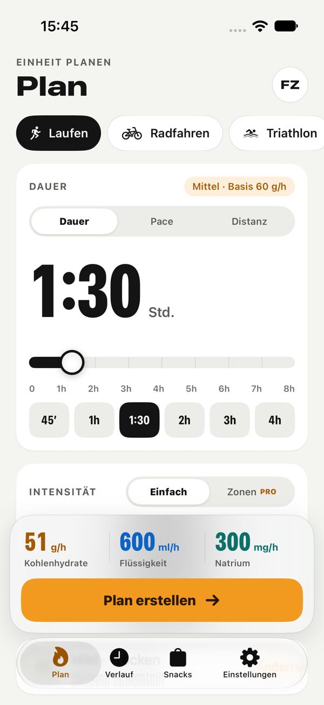
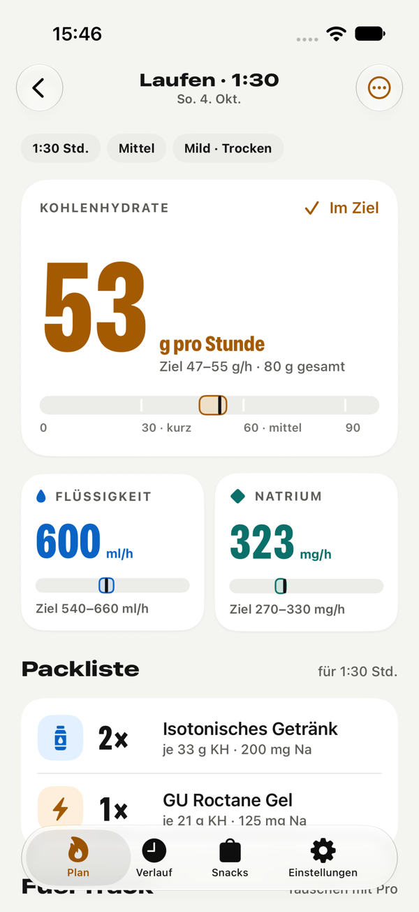
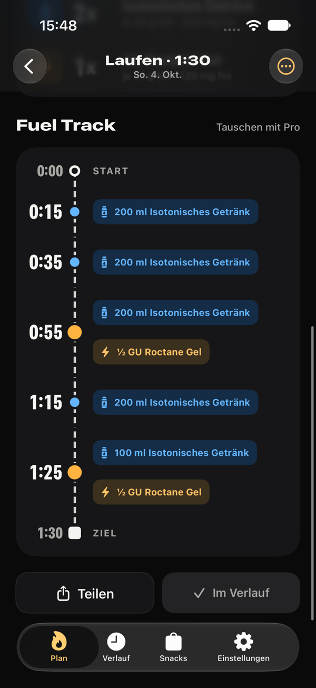
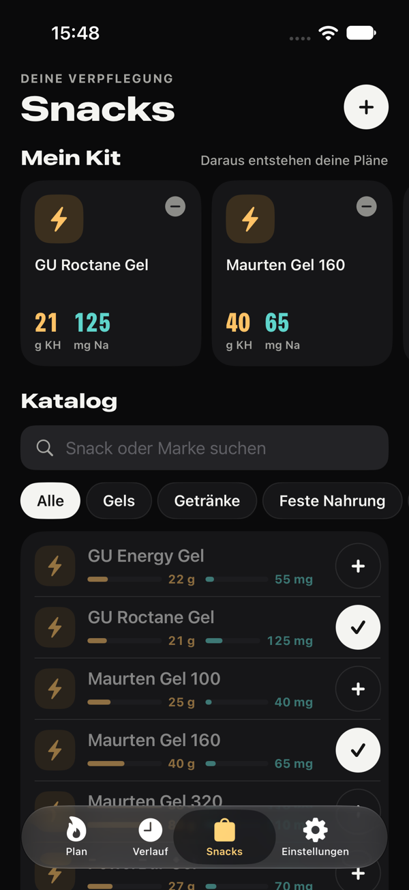
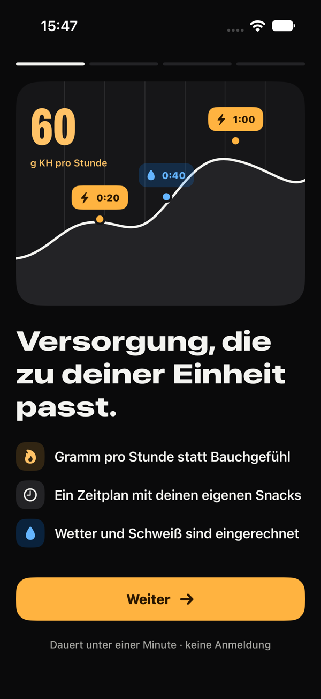
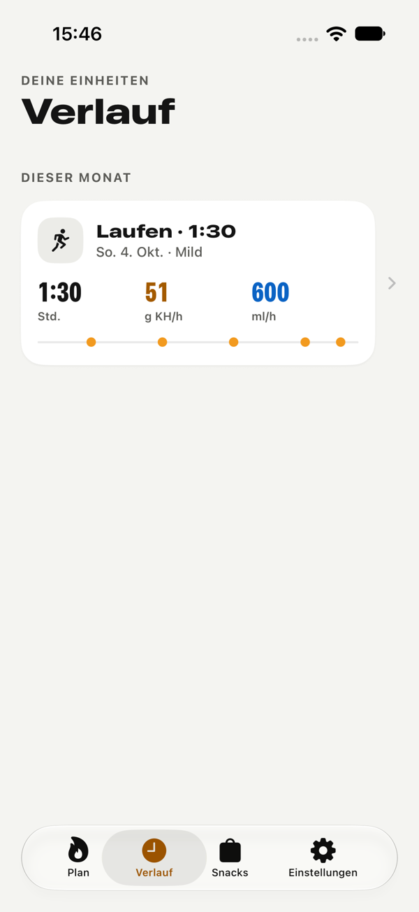
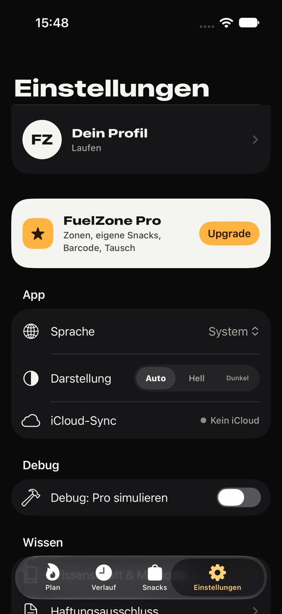
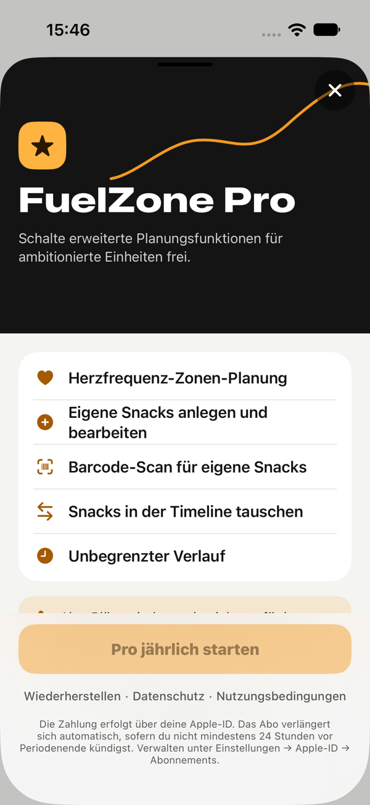

# FuelZone

**Versorgung, die zu deiner Einheit passt.** · *Fuel that fits your session.*

FuelZone ist eine iOS-App für Ausdauersportler:innen. Du beschreibst deine nächste Einheit – Sportart, Dauer, Intensität, Wetter – und bekommst einen **konkreten Versorgungsplan**: wie viele **Kohlenhydrate, Flüssigkeit und Natrium pro Stunde**, eine **Packliste** und den **Fuel Track**, also wann du was zu dir nimmst. Gebaut aus den Snacks, die du wirklich dabeihast.

| Plan | Ergebnis | Fuel Track | Snacks |
|------|----------|------------|--------|
|  |  |  |  |

| Onboarding | Verlauf | Einstellungen | Pro |
|------------|---------|---------------|-----|
|  |  |  |  |

---

## Funktionen

### Planen
- **Sportart** als Chips: Laufen, Radfahren, Triathlon, Wandern, Sonstiges.
- **Dauer** wie auf einer Rennuhr: Lineal-Slider (15 min – 8 h) mit Schnellwahl (45′, 1h, 1:30, 2h, 3h, 4h), alternativ **Distanz + Pace** oder **Distanz + Zeit**.
- **Intensität**: Leicht / Mittel / Hart, mit Live-Anzeige der g/h je Stufe, oder **Herzfrequenz-Zonen in Minuten** (Pro).
- **Bedingungen**: Temperatur und Wetter manuell oder automatisch per Standort bzw. Ortssuche (Open-Meteo).
- **Live-Dock**: Kohlenhydrate, Flüssigkeit und Natrium pro Stunde ändern sich, während du planst.

### Ergebnis
- **Große Kennzahl** (geplante g/h) mit Status *Im Ziel* und einem **Stufen-Meter** (30 / 60 / 90 g/h).
- **Flüssigkeit und Natrium** mit Zielbereich und Markierung.
- **Packliste**: was du einpacken musst (z. B. 2× Gel, 1× Iso 500 ml, 250 ml Wasser).
- **Fuel Track**: der Zeitplan als Strecke mit Verpflegungspunkten (0:15, 0:35, …); Snacks lassen sich antippen und tauschen (Pro).
- **Teilen** als Text, **Umbenennen**, Warnhinweise (z. B. Magen-Grenze, Glukose-Fruktose-Mix bei langen Einheiten).

### Snacks
- **Mein Kit**: nur diese Snacks nutzt der Planer. Neue Nutzer starten mit 4 Snacks (Maurten Gel 160, GU Roctane, Iso-Getränk, Salztablette).
- **Katalog** mit 28 Produkten, Suche, allen Kategorien und Balken für KH und Natrium.
- **Eigene Snacks** mit Foto, Nährwerten pro Portion oder pro 100 g (Pro).
- **Barcode-Scan** über Open Food Facts mit Duplikat-Erkennung (Pro).

### Verlauf
- Alle Pläne nach Monat gruppiert, mit Kennzahlen und Mini-Track.
- Wischen zum **Löschen** oder **Erneut planen**; Detailansicht mit vollem Plan.
- Free: die letzten 10 Einheiten sichtbar (ältere bleiben gespeichert), Pro: unbegrenzt.

### Profil & Einstellungen
- Profil wird sofort gespeichert: Name, Gewicht, Sportart, Magenempfindlichkeit, Schweißrate, Salzgehalt, max. Herzfrequenz, **eigene HF-Zonengrenzen** (Pro).
- Sprache (System / Deutsch / Englisch), Darstellung (Auto / Hell / Dunkel), iCloud-Sync-Status.
- **Wissenschaft & Methodik** mit Quellen (Jeukendrup, Burke u. a.), Haftungsausschluss, Datenschutz, Nutzungsbedingungen.

### FuelZone Pro
| Feature | |
|---|---|
| Planung mit Herzfrequenz-Zonen | Minuten pro Zone 1–5 |
| Eigene Snacks & Barcode-Scan | inkl. Fotos |
| Snacks im Fuel Track tauschen | Menge wird passend umgerechnet |
| Unbegrenzter Verlauf | |

Monatlich (3,99 €) oder jährlich (24,99 €) über StoreKit 2. Der Pro-Status wird **immer aus den StoreKit-Berechtigungen abgeleitet** und nie gespeichert.

---

## Wie der Plan berechnet wird

1. **Kohlenhydrate** in absoluten g/h nach Dauer: unter 75 min ≈ 30 g/h, bis 2,5 h ≈ 60 g/h, darüber ≈ 90 g/h. Skaliert nach Intensität (Leicht 70 %, Mittel 85 %, Hart 100 %, bzw. gewichtet über die Zonen-Minuten).
2. **Magen**: *Konservativ* begrenzt auf ≈ 77 g/h, *Verträglich* erlaubt ab 2,5 h bis ≈ 100 g/h.
3. **Flüssigkeit** = Schweißrate × Temperatur × Wetter; **Natrium** = Flüssigkeit × Salzgehalt des Schweißes.
4. **SnackComposer**: plant nach den *aufgelaufenen* Zielen, damit keine Überdosierung entsteht. Er nimmt Iso-Getränk in Schlucken plus Wasser, wählt Gels (auch halbe) passend zur Lücke und achtet beim Natrium auf natriumarme Gels, wenn das Ziel schon erreicht ist. Er nutzt nur Snacks aus deinem Kit.
5. **Ergebnis**: Ziel als Bereich (±8–10 %), die **geplanten Werte** kommen aus den echten Snacks (Soll vs. Ist).

Code: [`Core/FuelingCalculator.swift`](NutritionApp/Core/FuelingCalculator.swift), [`Core/SnackComposer.swift`](NutritionApp/Core/SnackComposer.swift), [`Core/ExerciseCarbGuidelines.swift`](NutritionApp/Core/ExerciseCarbGuidelines.swift).

---

## Design – „Race Instrument“

- **Zahlen** in SF Pro *Compressed* (wie eine Rennuhr), **Titel** in SF Pro *Expanded*, alles über Text Styles, also mit **Dynamic Type**.
- **Amber füllt nur die eine Hauptaktion** pro Screen; Auswahlen sind Tinte (Schwarz im Light, Weiß im Dark Mode).
- **Feste Datenfarben**: Kohlenhydrate Amber, Flüssigkeit Blau, Natrium Türkis.
- **Light und Dark Mode** als Asset-Farben, alle Textfarben ≥ 4,5 : 1 Kontrast (WCAG).
- Native **TabView** (Liquid Glass ab iOS 26), 44-pt-Touch-Ziele, VoiceOver-Labels.

Tokens: [`Design/Theme.swift`](NutritionApp/Design/Theme.swift) · Bausteine: [`Design/Components.swift`](NutritionApp/Design/Components.swift), [`Design/FuelTrackView.swift`](NutritionApp/Design/FuelTrackView.swift) · Style Guide als Xcode-Preview: [`Design/DesignSystemPreview.swift`](NutritionApp/Design/DesignSystemPreview.swift).

---

## Daten & Datenschutz

- **Kein Konto, keine Werbung, kein Tracking.**
- Lokale Wahrheit: JSON-Dateien in *Application Support* ([`UserDataStore`](NutritionApp/Services/UserDataStore.swift)).
- **iCloud**: ein CloudKit-Datensatz pro Element in der privaten Datenbank, Merge nach „neuer gewinnt“ inklusive Löschmarkierungen ([`CloudSyncService`](NutritionApp/Services/CloudSyncService.swift), [`SyncMerge`](NutritionApp/Core/SyncMerge.swift)). Sync beim Start, bei Rückkehr in die App und nach Änderungen.
- Ältere Versionen (UserDefaults/iCloud-KVS) werden beim ersten Start automatisch übernommen.
- Standort nur auf Knopfdruck, wird nicht gespeichert; Snack-Fotos bleiben auf dem Gerät.
- Rechtstexte: [`docs/privacy.md`](docs/privacy.md), [`docs/terms.md`](docs/terms.md) (GitHub Pages).

---

## Architektur

```
NutritionApp/
├── Core/          Rechenlogik ohne UI: FuelingCalculator, SnackComposer, ExerciseCarbGuidelines,
│                  FuelPlanSummary (Packliste/Soll-Ist), FuelPlanEditor (Tausch), SyncMerge,
│                  InputParsing, PlanPresentation (Fuel-Track-Modelle, Teilen-Text), L10n
├── Models/        UserProfile, SessionSetup, SessionRecord, FuelingResult, TimelineStep,
│                  Snack, SnackLibrary (Kit), AppSettings, Enums
├── Services/      UserDataStore, FileStore, CloudSyncService, SubscriptionManager,
│                  WeatherService, LocationAccessService, OpenFoodFactsClient, SnackPhotoStore
├── ViewModels/    AppState, SessionViewModel, PlanResultViewModel, SnackViewModel, OnboardingViewModel
├── Design/        Theme, Components, FuelTrackView, DesignSystemPreview
├── Views/         Onboarding, Plan, Results, History, Snacks, Settings, Components (Paywall)
└── Resources/     DefaultSnacks.json · de.lproj / en.lproj (Localizable + InfoPlist)
```

- **MVVM**, `ObservableObject`, Default-Actor-Isolation `MainActor`, keine Compiler-Warnungen.
- Eine Datenquelle (`UserDataStore`) für Profil, Einstellungen, Verlauf und Kit; ViewModels lesen daraus.
- Komplett **Deutsch und Englisch**, umschaltbar in der App.

---

## Installation & Start

```bash
git clone https://github.com/marcellomerico/FuelZone.git
cd FuelZone
open NutritionApp.xcodeproj
```

1. Target **NutritionApp** → *Signing & Capabilities* → Team wählen (iCloud/CloudKit-Container `iCloud.com.mmerico.FuelZone`).
2. Scheme **NutritionApp** nutzt `FuelZone.storekit` für lokale Abo-Tests.
3. Simulator wählen → **Run** (⌘R). Im Debug-Build gibt es unter *Einstellungen → Debug* einen Schalter „Pro simulieren“.

### Tests

```bash
xcodebuild test -scheme NutritionApp -destination 'platform=iOS Simulator,name=iPhone 17'
```

| Suite | Inhalt |
|---|---|
| `FuelingCalculatorTests`, `ExerciseCarbGuidelinesTests` | Dauer-Stufen, Intensität, Magen-Grenze, Natrium |
| `CalculationCoreTests` | SnackComposer über viele Dauern/Intensitäten, Packliste, Parser, Grenzen, Vorschau, Altdaten |
| `DataLayerTests` | Kit, Migration, Persistenz, iCloud-Merge, Löschen, Tausch, Pro-Ableitung, Onboarding |
| `HeartRateZone*Tests` | Zonen und Minuten-Verteilung |
| `CodeReviewFindingsTests` | Regressionstests für alle bestätigten Review-Funde |
| `FlowUITests` | Onboarding → Plan → Ergebnis → Verlauf → Löschen, Kit, Pace-Eingabe, Pro-Sperre |
| `UIReviewScreenshots` | optional: `TEST_RUNNER_UI_MODE=light\|dark` erzeugt Screenshots aller Screens |

---

## Konfiguration

| Einstellung | Wert |
|---|---|
| Bundle ID | `com.mmerico.FuelZone` |
| Min. iOS | 17.0 (iPhone) |
| iCloud | CloudKit, Container `iCloud.com.mmerico.FuelZone` |
| Abos | `com.mmerico.FuelZone.pro.monthly`, `com.mmerico.FuelZone.pro.yearly` |

---

## Dokumentation

- [`docs/CODE_REVIEW.md`](docs/CODE_REVIEW.md): Code Review mit Status pro Fund
- [`docs/UI_REVIEW.md`](docs/UI_REVIEW.md): UI/UX-Review und Design-Herleitung
- [`docs/IMPLEMENTATION_PLAN.md`](docs/IMPLEMENTATION_PLAN.md): Umsetzungsplan des Redesigns
- [`docs/PRE_LAUNCH_CHECKLIST.md`](docs/PRE_LAUNCH_CHECKLIST.md): Schritte bis zum App Store
- [`docs/PRODUCT_ROADMAP.md`](docs/PRODUCT_ROADMAP.md): Wettbewerb und Roadmap

---

## Haftung

FuelZone liefert **allgemeine Sporternährungs-Empfehlungen**, keine medizinische Beratung. Produkte und Mengen immer im Training testen.

## Autor

[Marcello Merico](https://github.com/marcellomerico) · [github.com/marcellomerico/FuelZone](https://github.com/marcellomerico/FuelZone)
