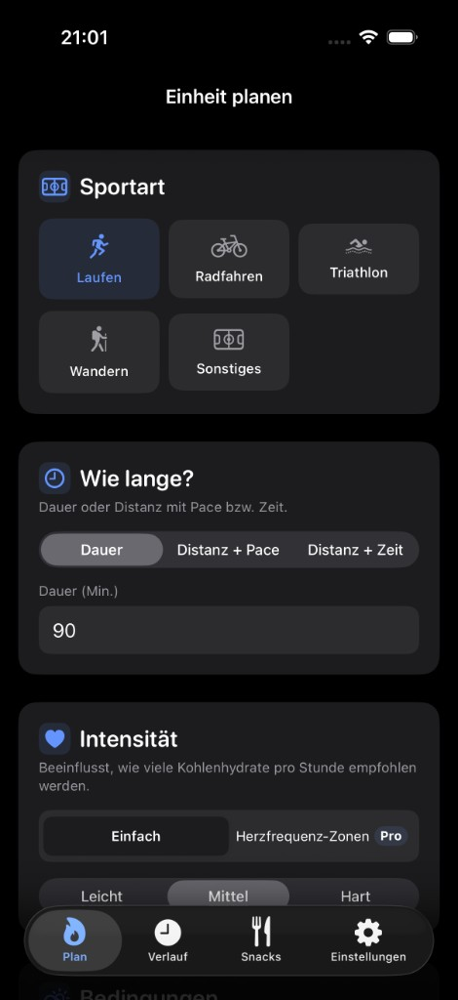
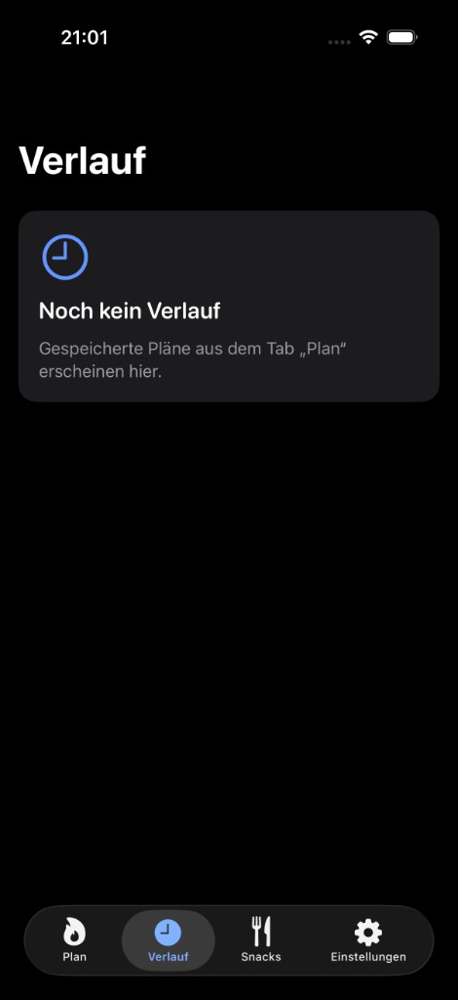
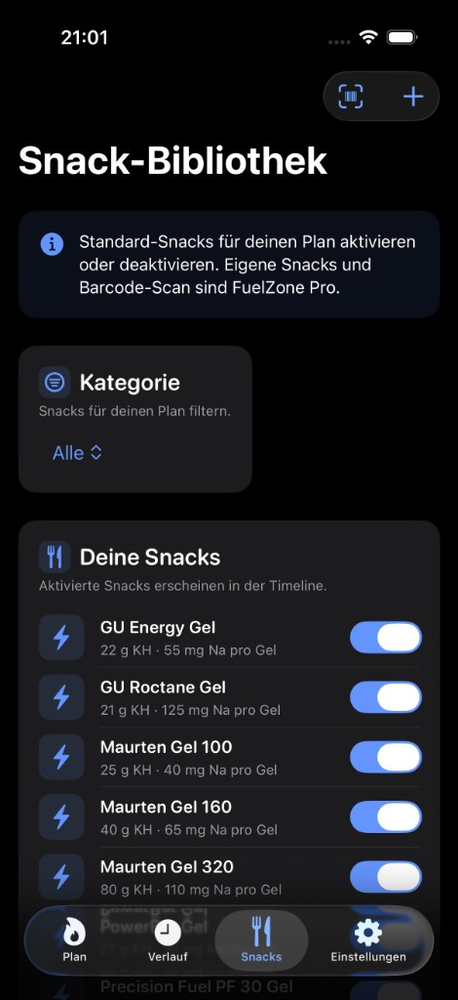
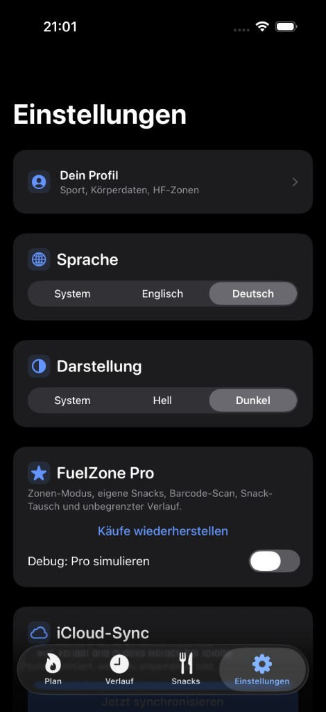
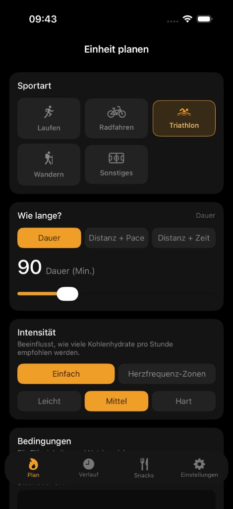
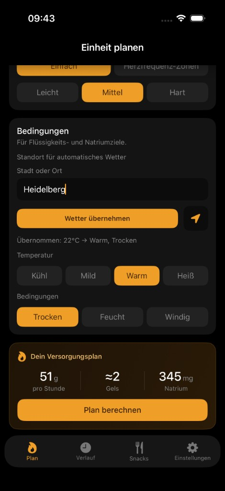
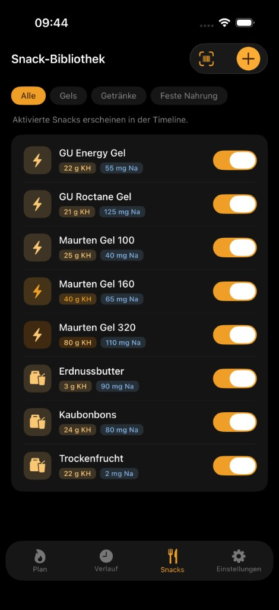
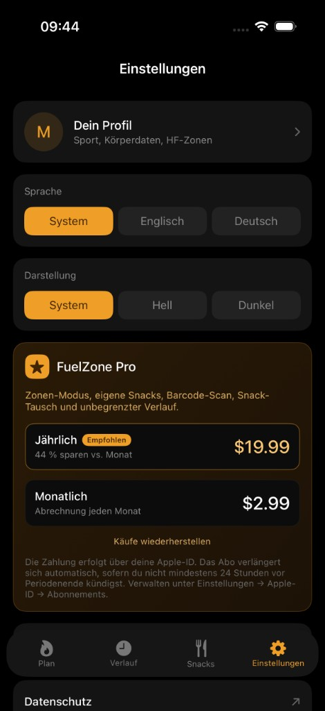

# FuelZone

**Versorgung, die zu deiner Einheit passt.**  
*Fuel that fits your session.*

FuelZone ist eine iOS-App für Ausdauersportler:innen. Sie berechnet **Kohlenhydrate, Flüssigkeit und Natrium** für eine geplante Ausdauereinheit und stellt den Plan als **Zeitplan mit Snack-Vorschlägen** dar — wissenschaftlich fundiert, in **Gramm pro Stunde** und **HF-Zonen-Minuten**, nicht als veraltete g/kg-Tabelle.

---

## Features

| Bereich | Funktion |
|--------|----------|
| **Onboarding** | Sportart (3×2-Grid), Magen, Schweiß, Salz, optional Gewicht & max. HF |
| **Profil** | Einstellungen → *Dein Profil*: Onboarding-Werte bearbeiten, **manuelle HF-Zonengrenzen** (BPM), Standard-Zonen aus max. HF |
| **Einheit planen** | Dauer; Distanz+Pace oder Distanz+Zeit; einfache Intensität oder **HF-Zonen in Minuten** (Pro) |
| **Berechnung** | Evidenzbasierte **30 / 60 / 90 g/h** nach Dauer & Intensität (`ExerciseCarbGuidelines`); Flüssigkeit & Natrium aus Profil/Wetter |
| **Ergebnis** | Bereiche, Timeline (20-Min-Schritte), Snack-Plan; **Snack-Tausch** in der Timeline (Pro) |
| **Snacks** | Standard-Bibliothek, eigene Snacks, **Barcode** via Open Food Facts (Pro) |
| **Verlauf** | Gespeicherte Pläne mit Detailansicht; Free: letzte 10 Einheiten, Pro: unbegrenzt |
| **Einstellungen** | Sprache (DE/EN), Erscheinungsbild, **StoreKit Pro-Abo**, iCloud-Sync, Methodik & Haftung |
| **Sync** | Profil, Verlauf & Snacks über **UserDefaults + iCloud Key-Value Store + CloudKit** (private DB) |

### FuelZone Pro

| Feature | Beschreibung |
|--------|----------------|
| HF-Zonen-Modus | Minuten pro Zone 1–5; BPM-Labels aus dem Profil |
| Barcode-Scanner | Snacks aus Open Food Facts anlegen |
| Snack-Tausch | Alternative in der Timeline wählen |
| Unbegrenzter Verlauf | Mehr als 10 gespeicherte Einheiten |

Abo-Kauf und Wiederherstellen unter **Einstellungen → FuelZone Pro** (StoreKit 2). Lokales Testen mit `FuelZone.storekit` im Xcode-Scheme. Im **Debug**-Build zusätzlich ein Pro-Toggle zum Entwickeln.

---

## UI-Vergleich (Vorher/Nachher)

### Vorher (2026-05-29)

| Plan | Verlauf |
|------|---------|
|  |  |

| Snacks | Einstellungen |
|--------|---------------|
|  |  |

### Nachher (2026-06-02)

| Plan | Plan (Bedingungen + Vorschau) |
|------|-------------------------------|
|  |  |

| Snacks | Einstellungen |
|--------|---------------|
|  |  |

> Hinweis: Die Screenshots stammen vom iPhone 17 Pro Simulator und dokumentieren den Schritt von der alten dunklen UI zur Amber-Redesign-Version.

---

## Anforderungen

- **Xcode** 15+ (empfohlen: aktuelle Version mit iOS 17 SDK)
- **iOS 17.0+** (nur iPhone)
- Apple-ID mit **iCloud** für Datensynchronisation
- Geräte-Build: Signing mit Bundle-ID `com.mmerico.FuelZone`, Capabilities **iCloud** (KVS + CloudKit)

---

## Installation & Start

```bash
git clone https://github.com/marcellomerico/FuelZone.git
cd FuelZone   # Repository-Name; lokaler Ordner kann z. B. NutritionApp heißen
open NutritionApp.xcodeproj
```

1. Target **NutritionApp** → **Signing & Capabilities** → Team wählen.  
2. Scheme **NutritionApp**: optional **StoreKit Configuration** = `FuelZone.storekit` für Abo-Tests.  
3. Simulator (z. B. iPhone 17 Pro) → **Run** (⌘R).  
4. Erster Start: **Onboarding**, danach Tabs **Plan · Verlauf · Einstellungen**.

### Tests ausführen

```bash
xcodebuild test \
  -scheme NutritionApp \
  -destination 'platform=iOS Simulator,name=iPhone 17 Pro'
```

Oder in Xcode: **Product → Test** (⌘U).

| Test-Target | Inhalt |
|-------------|--------|
| `FuelingCalculatorTests` | Kurze/ultra Einheiten, Zonen-Mix, Magen-Cap |
| `ExerciseCarbGuidelinesTests` | Dauer-Stufen, Intensitätsskala |
| `HeartRateZoneCalculatorTests` | Standard-Zonen aus max. HF |
| `HeartRateZoneDistributionTests` | Exakte Minuten-Summe = Session-Dauer |

> **Hinweis:** `xcodebuild test` in der CLI kann je nach Simulator-Setup fehlschlagen; ⌘U in Xcode ist zuverlässiger.

---

## Architektur

```
MVVM — Business-Logik ohne UI (FuelingCalculator, ExerciseCarbGuidelines, SnackComposer)

NutritionApp/
├── Core/              FuelingCalculator, ExerciseCarbGuidelines, HeartRateZoneCalculator, SnackComposer
├── Models/            UserProfile, SessionSetup, HeartRateZoneDistribution, FuelingResult, …
├── ViewModels/        AppState, SessionViewModel, ResultsViewModel, …
├── Views/             Onboarding, Session, Results, Snacks, History, Settings (inkl. ProfileView)
├── Services/          DataStore, CloudKitDataStore, SubscriptionManager, OpenFoodFactsClient
├── Design/            DesignSystem, FuelZoneUIComponents
├── Resources/         DefaultSnacks.json
└── en.lproj / de.lproj   Localizable.strings

NutritionAppTests/     Unit-Tests für Rechner und Zonen
docs/                  PRODUCT_ROADMAP.md (Produkt & Wettbewerb)
```

- **Kein SwiftData** — JSON in UserDefaults, Spiegelung in iCloud KVS, zusätzlich CloudKit private DB  
- **Lokalisierung:** UI über `Localizable.strings` (EN + DE)  
- **UI:** gemeinsame Bausteine in `FuelZoneUIComponents.swift`, Tokens in `DesignSystem.swift`

---

## Kernalgorithmus (Kurzüberblick)

1. **Kohlenhydrate:** Absolut **g/h** nach Dauer-Tier (unter 75 min → ~30 g/h, bis ~2,5 h → ~60 g/h, länger → bis 90 g/h), gewichtet bei HF-Zonen-Minuten; begrenzt durch Magen-Cap. Details und Quellen: **Einstellungen → Methodik** (`FuelingMethodologyView`).  
2. **Flüssigkeit:** Schweißrate × Temperatur × Wetter.  
3. **Natrium:** Flüssigkeit (L/h) × Salz-Konzentration (mg/L).  
4. **HF-Zonen:** Obere BPM-Grenzen im **Profil** (manuell oder Standard aus max. HF); im Plan nur Minuten pro Zone — Summe muss **exakt** der Session-Dauer entsprechen.  
5. **Timeline:** Schritte à 20 Minuten; `SnackComposer` wählt passende Snacks; Pro: Tausch über `SnackSwapSheet`.

Code: `NutritionApp/Core/FuelingCalculator.swift`, `ExerciseCarbGuidelines.swift`, `HeartRateZoneCalculator.swift`.

---

## Konfiguration

| Einstellung | Wert |
|-------------|------|
| Display Name | FuelZone |
| Bundle ID | `com.mmerico.FuelZone` |
| Min. iOS | 17.0 |
| Geräte | iPhone only |
| iCloud Container | `iCloud.com.mmerico.FuelZone` |
| StoreKit Config | `FuelZone.storekit` (lokal) |

---

## Roadmap

Ausführliche Prioritäten, Wettbewerb und Differenzierung: [`docs/PRODUCT_ROADMAP.md`](docs/PRODUCT_ROADMAP.md).

Kurzfristig u. a.:

- [ ] Pro-Paywall direkt bei HF-Zonen (Kauf im Sheet, weniger Debug-Abhängigkeit)
- [ ] App Store-Produkt & Scheme final verknüpfen
- [ ] App-Icon, Launch Screen, getauschte Snacks dauerhaft im Verlauf
- [ ] HealthKit / Garmin / Strava (Vorausfüllen) — mittelfristig

---

## Haftung

FuelZone liefert **allgemeine Sporternährungs-Empfehlungen**, keine medizinische Beratung. Ziele und Zufuhr immer individuell anpassen.

---

## Autor

[Marcello Merico](https://github.com/marcellomerico) · Repository: [github.com/marcellomerico/FuelZone](https://github.com/marcellomerico/FuelZone)
